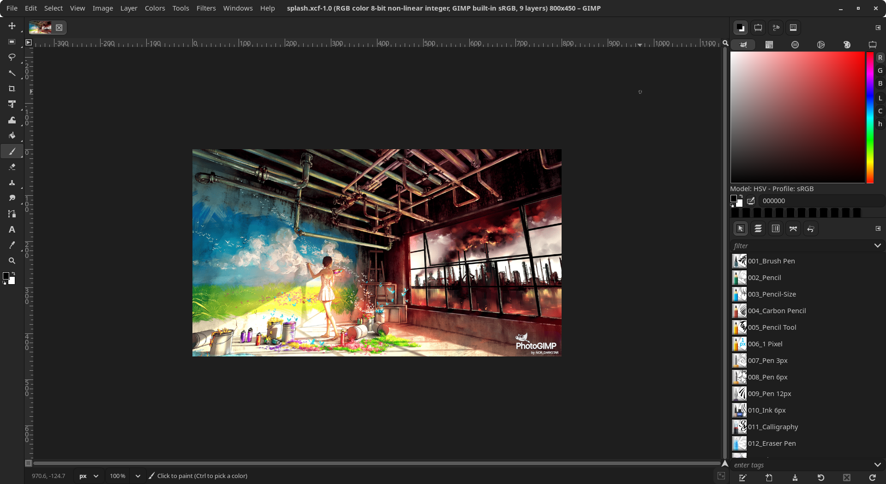

# PhotoGimpainter
 A Patch for GIMP 3+ for Digital Artists and Adobe Photoshop users, including features like:

* New Splash Screen;
* Tools organized to mimic the position of Adobe Photoshop;
* New default settings to maximize space on the canvas;
* Shortcuts similar to the ones in Photoshop for Windows,

## 📷 Screenshots

  
  
 <em>PhotoGimpainter Splash Art</em>

  
  
 <em>GIMP 3.0 with the PhotoGimpainter patch applied</em>

## ⚙ How to Install

This patch is intended to work with the Linux version of GIMP , but it can be used in almost any package format with no restriction by extracting the files on the correct folders.

## Linux

In order to install the PhotoGimpainter on your Linux operating system, just follow this simple steps:

1. Make sure you already have GIMP installed 
2. **Start and quit GIMP after you installed before you continue!**
3. Download the zip files from this repository [or just click here](https://github.com/Nor-darkstar/PhotoGimpainter/archive/master.zip);
4. Extract the content of the zip file and run installer script in terminal as ./install.sh
5. Alternate way to install the patch by simply running the any one of the following commond in the terminal
  
  | Method    | Command                                                                                           |
| :-------- | :------------------------------------------------------------------------------------------------ |
| **curl**  | `sh -c "$(curl -fsSL https://raw.githubusercontent.com/Nor-darkstar/PhotoGimpainter/master/Tools/gimpatcher)"` |
| **wget**  | `sh -c "$(wget -O- https://raw.githubusercontent.com/Nor-darkstar/PhotoGimpainter/master/Tools/gimpatcher)"`   |
| **fetch** | `sh -c "$(fetch -o - https://raw.githubusercontent.com/Nor-darkstar/PhotoGimpainter/master/Tools/gimpatcher)"` |

7. You're done, enjoy it! :smile:

##  Windows

In order to install the PhotoGimpainter on your Windows:

1. Make sure you already have [GIMP installed from official website](https://www.gimp.org/downloads/);
2. **Start and quit GIMP after you installed before you continue!**
3. Download thes files from this repository or [just click here](https://github.com/Nor-darkstar/PhotoGimpainter/archive/master.zip);
4. Extract the content from `PhotoGimpainter-master.zip` to a folder of your preference;
5. Hold <kbd>Windows</kbd> key and press <kbd>R</kbd> to open the *Execute* dialog;
6. Type `%APPDATA%\GIMP` into the dialog and press <kbd>Enter</kbd>;
7. Make sure to take backup of original configuration simply by renaming the `3.0 folder to 3.0_bak`
8. Now create the new folder `3.0` and copy the contents from extracted zip file `PhotoGimpainter-master/PhotoGimpainter`
9. Paste all files and folders in newly created `3.0` folder inside the GIMP's AppData folder that you just opened;
10. You're done, enjoy it! :smile:

##  macOS

In order to install the PhotoGimpainter on your macOS:

1. Make sure you already have [GIMP installed from official website](https://www.gimp.org/downloads/);
2. **Start and quit GIMP after you installed before you continue!**
3. Download the files from this repository or [just click here](https://github.com/Nor-darkstar/PhotoGimpainter/archive/master.zip);
4. Extract the content from `PhotoGimpainter-master.zip` to a folder of your preference;
5. Open Finder, press <kbd>Cmd</kbd> + <kbd>Shift</kbd> + <kbd>G</kbd> to open "Go to Folder";
6. Type `~/Library/Application Support/GIMP` and press <kbd>Enter</kbd>;
7. If you have a `2.10` folder from a previous installation, delete it to avoid conflicts;
8. Make sure to take backup of original configuration simply by renaming the `3.0 folder to 3.0_bak`
9. Now create the new folder `3.0` and copy the contents from extracted zip file `PhotoGimpainter-master/PhotoGimpainter`
10.  Paste all files and folders in newly created `3.0` folder inside the GIMP's Library folder that you just opened;
11. You're done, enjoy it! :smile:

## Credits
